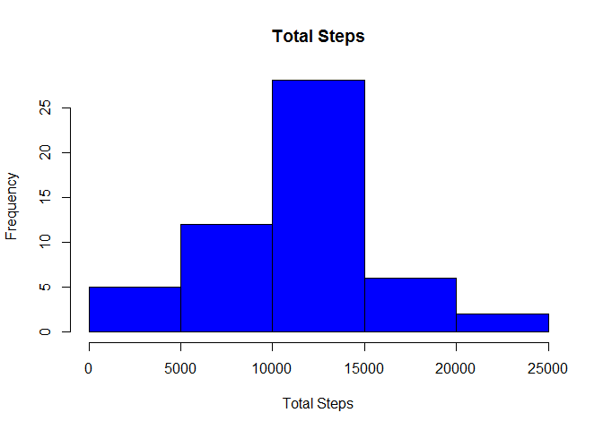
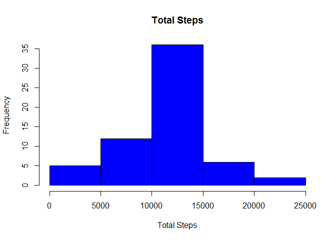

# Reproducible Research: Peer Assessment 1


## Loading and preprocessing the data

```r
        data <- read.csv("activity.csv", header=T)

        #data$date <- as.POSIXct(data$date)

        #add a feature to identify the type of day (weekday vs weekend) to be used in some
        #later analysis
        data$typeofday[weekdays(as.POSIXct(data$date)) %in% c('Saturday','Sunday')] <- "Weekend"

        #any "typeofday" value that is NA is a weekday so set it as such below
        data$typeofday[is.na(data$typeofday)] <- "Weekday"

        #convert typeofday to a factor variable
        data$typeofday <-as.factor(data$typeofday)
```


## Mean and Median Steps Per Day

```r
        #load the dplyr package in oder to use group_by function
        if (!require(dplyr)) 
        {
                install.packages("dplyr")
                library(dplyr)
                require(dplyr)
        }
```

```
## Loading required package: dplyr
```

```
## Warning: package 'dplyr' was built under R version 3.1.2
```

```
## 
## Attaching package: 'dplyr'
## 
## The following object is masked from 'package:stats':
## 
##     filter
## 
## The following objects are masked from 'package:base':
## 
##     intersect, setdiff, setequal, union
```

```r
        #use only the non NA values in this calculation
        #group by date and count the total number of steps per day
        date.based.summary <- data[complete.cases(data),]%>%
                group_by(date)%>% 
                        summarise(totalsteps=sum(steps))

        #create a histogram
        hist (date.based.summary$totalsteps, main="Total Steps", xlab="Total Steps", col="blue")
```

 

```r
        meansteps <- as.character(round(mean(date.based.summary$totalsteps), digits=0))
        mediansteps <- as.character(round(median(date.based.summary$totalsteps), digits=0))
```

* The average number of steps taken per day were 10766 and the median number of steps were 10765


## Daily Activity Patterns

```r
        # Make a time series plot (i.e. type = "l") of the 5-minute interval (x-axis) and the
        #average number of steps taken, averaged across all days (y-axis)

        interval.based.summary <- data[complete.cases(data),]%>%
                group_by(interval)%>% 
                        summarise(meansteps=mean(steps))

        plot(interval.based.summary$interval, interval.based.summary$meansteps, type = "l", 
        main = "Average Steps per Time Period", xlab = "Time Period", ylab = "Average Steps")
```

 

```r
        # Which 5-minute interval, on average across all the days in the dataset, contains the                
        #maximum number of steps?

        most.active.time <- as.character(subset(interval.based.summary, meansteps==max(meansteps), 
        select=c("interval")))
```

* The most active time period of the day is period 835


## Imputing Missing Values


```r
#Calculate and report the total number of missing values in the dataset 
#(i.e. the total number of rows with NAs)

missing.steps <- sum(is.na(data$steps))
missing.date <- sum(is.na(data$date))
missing.interval <- sum(is.na(data$interval))
```

* There are 2304 observations with missing steps
* There are 0 observations with missing dates
* There are 0 observations with missing intervals


```r
#Devise a strategy for filling in all of the missing values in the dataset. 
#The strategy does not need to be sophisticated. For example, you could use 
#the mean/median for that day, or the mean for that 5-minute interval, etc.

#here is the data with NA values that we will want to fill in the blanks for
nadata <- data[!complete.cases(data),]

#this is the data that is fully populated
completedata <- data[complete.cases(data),]

#join the nadata to the interval based dataset so we can fill in the blanks
nadata <- merge (nadata, interval.based.summary, by.x="interval", by.y="interval", all.x=FALSE, all.y=FALSE)

#use mutate to update the steps feature (with NA's) with the meansteps from the interval set
nadata <- mutate(nadata, steps = round(meansteps, digits=0))

#drop the meansteps feature - no longer needed
nadata$meansteps<-NULL

#combine the updated nadata with the completedata to produce the final dataset.
newdata <- rbind(nadata,completedata)

date.based.summary <- newdata%>%
                group_by(date)%>% 
                        summarise(totalsteps=sum(steps))

hist (date.based.summary$totalsteps, main="Total Steps", xlab="Total Steps", col="blue")
```

 

```r
meansteps <- as.character(round(mean(date.based.summary$totalsteps), digits=0))
mediansteps <- as.character(round(median(date.based.summary$totalsteps), digits=0))
```


* The average number of steps taken per day **(after imputing missing data)** were 10766 and the median number of steps were 10762


## Weekday vs Weekend Activity Patterns


```r
library(tidyr)
```

```
## Warning: package 'tidyr' was built under R version 3.1.2
```

```r
#library (lattice)

       by_interval_and_type <- group_by (newdata, 
                                         combo = paste(interval, typeofday, sep= "~"))
        
        #sum the emissions by year
        weekday.vs.weekend.summary <- summarize(by_interval_and_type, mean(steps))
      
        #call the separate function to create a "year" column and "type" column
        weekday.vs.weekend.summary <- separate(data=weekday.vs.weekend.summary, 
                                               col=combo, into=c("interval", "typeofday"), sep= "~")

        weekday.vs.weekend.summary$typeofday <- as.factor(weekday.vs.weekend.summary$typeofday)

        colnames(weekday.vs.weekend.summary)[3] <- "meansteps"
        
        weekday.vs.weekend.summary$interval <- as.numeric(weekday.vs.weekend.summary$interval)

        weekdaymean <- mean(subset(weekday.vs.weekend.summary, 
                                   typeofday=="Weekday", 
                                   select=c("meansteps"))$meansteps)

        weekendmean <- mean(subset(weekday.vs.weekend.summary, 
                                   typeofday=="Weekend", 
                                   select=c("meansteps"))$meansteps)

        #creating a little data frame with the x & y co-ords for each plot.
        #in order to get ggplot to understand which facet to put the text on,
        #i needed to include the typeofday feature which is what is used for the facet
        # thanks to TRinkers R blog for pointing me in the right direction because it had 
        #me stumped.  
        #https://trinkerrstuff.wordpress.com/2012/09/01/add-text-annotations-to-ggplot2-faceted-plot/
        
        annotation.text.info <- data.frame(x=c(120,120), y=c(weekdaymean+5, weekendmean+5), 
                        label=c("Mean", "Mean"), 
                        typeofday=c("Weekday","Weekend"))

        library(ggplot2)
```

```
## Warning: package 'ggplot2' was built under R version 3.1.2
```

```r
        p <- ggplot(weekday.vs.weekend.summary, aes(x=interval, y=meansteps))
        p <- p + geom_line(color="firebrick")
        p <- p + labs (title="Weekday vs Weekend Comparison")
        p <- p + labs (x="Time Interval")
        p <- p + labs (y="Average Steps")
        p <- p + facet_wrap(~typeofday, ncol=2)
        p <- p + geom_line(stat = "hline", yintercept = "mean", color='blue', linetype=2)
        p <- p + geom_text(aes(x, y, label=label, group=NULL), data=annotation.text.info, 
                           color = "grey50", size=4) 

        print (p)
```

 

* The average number of steps taken per time period during the week were 35.608642 and the average number of steps taken per time period on the weekend were 42.3645833


